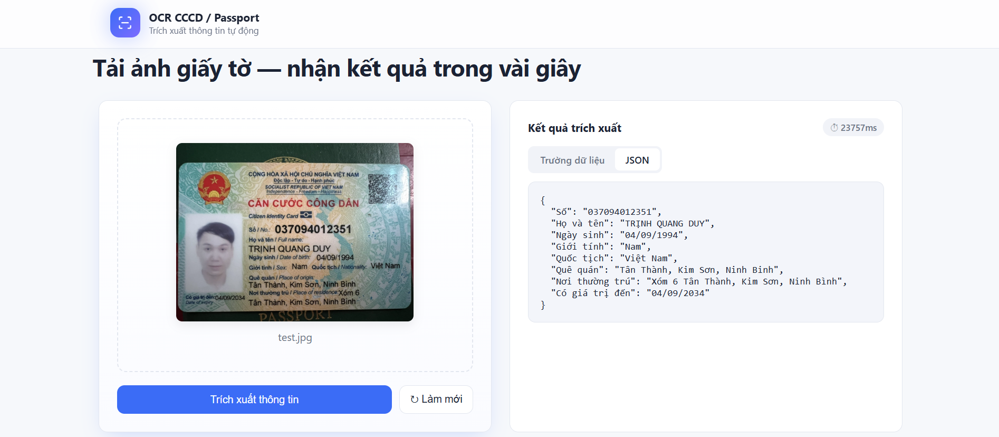

# Hệ thống OCR CCCD

## 1. Tổng quan
Dự án xây dựng một hệ thống OCR end-to-end nhằm trích xuất thông tin từ ảnh CCCD (Căn cước công dân). Hệ thống có khả năng xử lý ảnh trong nhiều điều kiện khác nhau và trả về dữ liệu có cấu trúc dạng JSON.


## 2. Pipeline xử lý
1. Ảnh đầu vào  
2. Tiền xử lý (resize, deskew)  
3. Nhận diện tài liệu  
4. Nhận diện vùng thông tin (bounding box)  
5. OCR (trích xuất văn bản)  
6. Hậu xử lý (chuẩn hóa, kiểm tra dữ liệu)  
7. Xuất JSON  


## 3. API Endpoints
   - **Endpoint**: `POST /ocr`
   - **Request**: file image
   - **Response**:  
   
     ```json
      {
        "Số": "079203001234",
        "Họ và tên": "NGUYỄN VĂN A",
        "Ngày sinh": "01/01/2000",
        "Giới tính": "Nam",
        "Quốc tịch": "Việt Nam",
        "Quê quán": "Xã Tân Phú, Huyện Đồng Phú, Tỉnh Bình Phước",
        "Nơi thường trú": "Phường Phú Lợi, TP. Thủ Dầu Một, Tỉnh Bình Dương",
        "Có giá trị đến": "01/01/2035"
      }
      ```  
   

## 4. Tiêu chí đánh giá
- **OCR Accuracy**: Đánh giá độ chính xác nhận dạng văn bản từ CCCD.  
- **Detection mAP**: Đánh giá khả năng phát hiện đúng vùng thông tin.  
- **Processing Time**: Đo thời gian xử lý trung bình cho mỗi ảnh.  
- **Robustness**: Kiểm tra hiệu quả trên ảnh mờ, nghiêng và thiếu sáng.  


## 5. Kết quả đạt được
- Trích xuất dữ liệu có cấu trúc dưới dạng JSON.  
- Độ chính xác OCR đạt trên 80% trên tập kiểm thử.  
- API xử lý nhanh, ổn định.


## 6. Chạy và kiểm thử API
### 1. Cài đặt
Tạo môi trường ảo (khuyến nghị):

```bash
python -m venv venv
```

Kích hoạt môi trường:
```bash
venv\Scripts\activate
```

Cài đặt dependencies:

```bash
pip install -r requirements.txt
```


### 2. Chạy server API
Khởi động server bằng Uvicorn:

```bash
python -m uvicorn main:app --host 127.0.0.1 --port 8000 --reload
```

> API sẽ chạy tại: http://127.0.0.1:8000


### 3. Kiểm thử API
Sử dụng file collection Postman có sẵn: [OCR-CCCD.postman_collection.json](./postman/OCR-CCCD.postman_collection.json)


## 7. Tổng quan giao diện



## 8. Công nghệ sử dụng
- **FastAPI:** Hệ thống backend API hiệu năng cao, hỗ trợ xử lý bất đồng bộ và dễ dàng mở rộng.
- **OpenCV:** Xử lý ảnh đầu vào, bao gồm tiền xử lý, cắt vùng và biến đổi hình ảnh.
- **YOLO:** Mô hình phát hiện đối tượng, dùng để định vị các vùng thông tin trên ảnh CCCD.
- **PaddleOCR / VietOCR:** Hệ thống nhận dạng ký tự quang học, trích xuất văn bản từ các vùng thông tin.

